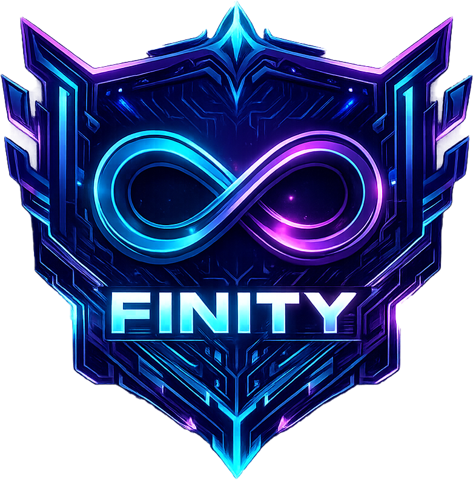

# FINITY | Infinite Skill. Zero Limits.



**Finity** is a cutting-edge web platform for a professional esports organization. Built with **Next.js**, **Tailwind CSS**, and **Framer Motion**, it delivers a premium, high-performance user experience designed to showcase the team's dominance, roster, and champion mentality.

## 🚀 Key Features

-   **Dynamic Visuals:** Immersive hero section with animated backgrounds, glowing effects, and a custom logo presentation.
-   **Roster Showcase:** Interactive player cards displaying roles (Pos 1-4) with glassmorphism effects and hover animations.
-   **Champion Mentality:** Dedicated sections highlighting the team's philosophy and strategic mastery in disciplines like *Magic Chess*.
-   **Scrimmage & Contact:** Integrated call-to-actions for scrimmages and community engagement.
-   **Responsive Design:** Fully optimized for seamless viewing on desktops, tablets, and mobile devices.
-   **Modern Aesthetics:** beautiful dark mode UI with neon accents (Cyan & Purple), custom typography (Orbitron & Outfit), and micro-interactions.

## 🛠️ Tech Stack

-   **Framework:** [Next.js 14+](https://nextjs.org/) (App Router)
-   **Language:** [TypeScript](https://www.typescriptlang.org/)
-   **Styling:** [Tailwind CSS](https://tailwindcss.com/)
-   **Animations:** [Framer Motion](https://www.framer.com/motion/)
-   **Icons:** [Lucide React](https://lucide.dev/)
-   **Fonts:** [Orbitron](https://fonts.google.com/specimen/Orbitron) (Headings) & [Outfit](https://fonts.google.com/specimen/Outfit) (Body)

## 🏁 Getting Started

Follow these steps to set up the project locally:

1.  **Clone the repository:**

    ```bash
    git clone https://github.com/your-username/finity-webfrontend.git
    cd finity-webfrontend
    ```

2.  **Install dependencies:**

    ```bash
    npm install
    # or
    yarn install
    # or
    pnpm install
    ```

3.  **Run the development server:**

    ```bash
    npm run dev
    ```

4.  **Open your browser:**
    Navigate to [http://localhost:3000](http://localhost:3000) to view the application.

## 📂 Project Structure

-   `app/`: Main application routes, layouts, and global styles (`globals.css`).
-   `components/`: Reusable UI components (Hero, Navbar, Roster, GameShowcase, etc.).
-   `components/ui/`: Generic UI elements like Buttons.
-   `public/`: Static assets (images, icons).

## 🎨 Customization

The project uses a custom Tailwind configuration defined in `tailwind.config.ts`.
-   **Primary Color:** Neon Cyan (`#00F0FF`)
-   **Secondary Color:** Neon Purple (`#7000FF`)
-   **Background:** Deep Space Black (`#030305`)

Fonts are configured in `app/layout.tsx` using `next/font/google`.

---

*Designed for Champions.*
